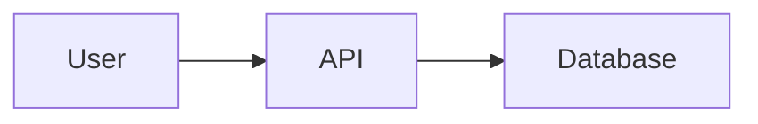

# Architecture diagrams

This directory holds visual artifacts that explain the project's architecture, data flow, and key components.

## Allowed formats

| Extension | Format | Use when |
|---|---|---|
| `*.mmd` | [Mermaid](https://mermaid.js.org/) | Structured diagrams: flowcharts, sequence diagrams, ER diagrams, state machines. Renders directly in GitHub markdown previews. |
| `*.excalidraw` | [Excalidraw](https://excalidraw.com/) | Hand-drawn-feel sketches: high-level system maps, ad-hoc whiteboard captures, less-formal explanations. Open with the Excalidraw web app or VS Code plugin. |

## Naming conventions

- `<topic>.mmd` or `<topic>.excalidraw` — kebab-case topic (e.g., `auth-flow.mmd`, `system-overview.excalidraw`)
- For multi-version diagrams: `<topic>-v<N>.mmd` (don't delete old versions; supersede)
- Examples shipped from the L3 template are named `*.example.<ext>` to make them obvious — replace or delete them as the project grows

## Embedding in markdown

Mermaid renders inline in GitHub:

````markdown

````

For local files, link them:

```markdown
See [auth flow](docs/architecture/auth-flow.mmd).
```

Excalidraw files are JSON; reference them but don't render inline.

## When to add a diagram

- A component's interaction is non-trivial to describe in prose
- An ADR's "Context" or "Decision" section would benefit from a visual
- Onboarding a new contributor needs a one-glance overview
- A failure mode is hard to explain without a flow

Don't add diagrams for trivial flows. Prose is faster to read for two-step interactions.

## Maintenance

- `/docs-refresh` (when shipped) flags diagrams whose source files haven't been touched since a related code component changed substantially.
- Outdated diagrams are worse than no diagrams. Remove or update; don't leave misleading.

## Source

This README and the `*.example.*` files are scaffolded from `~/.windsurf/templates/_shared/scaffold/docs/architecture/` per ADR-004.
